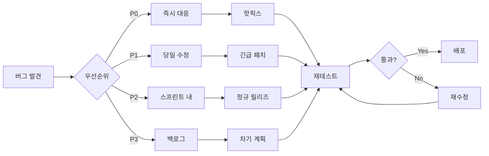

# 🔄 VideoPlanet 선순환 QA 프로세스

## 🎯 핵심 철학: "Build Quality In, Not Test Quality Out"

품질은 테스트로 만들어지는 것이 아니라, 개발 과정 전체에 내재되어야 합니다.

---

## 📊 선순환 구조 Overview

```
┌─────────────────────────────────────────────────────────┐
│                     선순환 QA 사이클                      │
├─────────────────────────────────────────────────────────┤
│                                                         │
│   계획 → 개발 → 테스트 → 배포 → 모니터링 → 피드백       │
│     ↑                                        ↓         │
│     └────────────── 지속적 개선 ←─────────────┘         │
│                                                         │
└─────────────────────────────────────────────────────────┘
```

---

## 🚀 Phase 1: Shift-Left Testing (개발 초기 품질 확보)

### 1.1 요구사항 단계 QA
```yaml
활동: Requirements Review
시점: 스프린트 계획 전
참여자: QA + PO + Dev Lead

체크리스트:
  ✅ 요구사항 명확성 검증
  ✅ 테스트 가능성 확인
  ✅ 수락 조건 정의
  ✅ 엣지 케이스 식별
  ✅ 성능 요구사항 명시

산출물:
  - 테스트 시나리오 초안
  - 리스크 평가서
  - 테스트 데이터 요구사항
```

### 1.2 설계 단계 QA
```yaml
활동: Design Review
시점: 코딩 시작 전
참여자: QA + Architect + Dev

체크리스트:
  ✅ 아키텍처 테스트 가능성
  ✅ API 계약 검증
  ✅ 보안 취약점 사전 검토
  ✅ 성능 병목 예상 지점
  ✅ 통합 포인트 식별

산출물:
  - API 테스트 명세
  - 통합 테스트 계획
  - 성능 테스트 전략
```

### 1.3 개발 중 QA
```yaml
활동: In-Sprint Testing
시점: 일일 개발 중
도구: Git Hooks + CI/CD

자동화 게이트:
  Pre-commit:
    - ESLint/Prettier 검증
    - 단위 테스트 실행
    - 커밋 메시지 검증
  
  Pre-push:
    - 전체 테스트 스위트
    - 코드 커버리지 체크 (>80%)
    - 보안 스캔
  
  PR/MR:
    - 통합 테스트
    - E2E 스모크 테스트
    - 성능 회귀 테스트
```

---

## 🔄 Phase 2: Continuous Testing (지속적 테스트)

### 2.1 테스트 자동화 피라미드
```
         /\
        /E2E\        (10%) - Critical User Journeys
       /______\
      /        \
     /Integration\   (30%) - API, Service Layer
    /______________\
   /                \
  /   Unit Tests     \ (60%) - Business Logic, Utils
 /____________________\
```

### 2.2 일일 테스트 사이클
```yaml
시간대별 자동 실행:
  06:00 - Nightly Build:
    - 전체 회귀 테스트 (2시간)
    - 성능 테스트 스위트
    - 보안 스캔
    - 테스트 리포트 생성
  
  09:00 - Morning Check:
    - Nightly 결과 리뷰
    - P0 버그 확인
    - 테스트 환경 상태 체크
  
  매 커밋:
    - 단위 테스트 (2분)
    - 린트 체크 (30초)
    - 빌드 검증 (3분)
  
  매 PR:
    - 통합 테스트 (10분)
    - 영향받는 E2E 테스트 (15분)
    - 코드 리뷰 체크리스트
  
  17:00 - EOD Check:
    - 오늘의 빌드 상태
    - 버그 현황 업데이트
    - 내일 우선순위 설정
```

### 2.3 테스트 환경 전략
```yaml
환경 구성:
  Local (개발자 PC):
    - 단위 테스트
    - 컴포넌트 테스트
    - Mock API
  
  Dev (개발 서버):
    - 통합 테스트
    - 최신 코드 자동 배포
    - 불안정 허용
  
  QA (테스트 서버):
    - 전체 테스트 스위트
    - 수동 탐색 테스트
    - 성능 테스트
  
  Staging (준운영):
    - 프로덕션 미러링
    - 최종 검증
    - 부하 테스트
  
  Production:
    - 카나리 배포
    - A/B 테스트
    - 실시간 모니터링
```

---

## 📈 Phase 3: Continuous Monitoring (지속적 모니터링)

### 3.1 Real-Time Quality Metrics
```javascript
// quality-dashboard.js
const QualityMetrics = {
  // 실시간 지표
  realtime: {
    errorRate: '< 1%',        // 5분 단위 측정
    responseTime: '< 500ms',   // P95
    availability: '> 99.9%',   // 1분 단위 체크
    activeUsers: 'real-time'   // 현재 사용자 수
  },
  
  // 일일 지표
  daily: {
    bugCount: { P0: 0, P1: '<3', P2: '<10' },
    testCoverage: '> 80%',
    deploymentSuccess: '> 95%',
    customerSatisfaction: '> 4.5/5'
  },
  
  // 주간 지표
  weekly: {
    velocityTrend: 'increasing',
    defectDensity: '< 0.5/KLOC',
    automationRate: '> 75%',
    techDebt: 'decreasing'
  }
};
```

### 3.2 프로덕션 모니터링
```yaml
모니터링 스택:
  Application:
    - Sentry: 에러 트래킹
    - Datadog APM: 성능 모니터링
    - LogRocket: 세션 리플레이
  
  Infrastructure:
    - CloudWatch: AWS 리소스
    - Prometheus: 메트릭 수집
    - Grafana: 시각화
  
  Business:
    - Google Analytics: 사용자 행동
    - Mixpanel: 이벤트 추적
    - Hotjar: 히트맵/녹화

알림 규칙:
  Critical (PagerDuty):
    - 에러율 > 5%
    - 응답시간 > 3초
    - 가용성 < 99%
  
  Warning (Slack):
    - 에러율 > 2%
    - 응답시간 > 1초
    - CPU/Memory > 80%
  
  Info (Email):
    - 일일 리포트
    - 주간 트렌드
    - 월간 분석
```

---

## 🐛 Phase 4: Bug Management Lifecycle

### 4.1 버그 발견 → 수정 프로세스


### 4.2 버그 예방 전략
```yaml
Proactive Measures:
  코드 리뷰:
    - 모든 PR 필수 리뷰
    - 체크리스트 기반 검증
    - 페어 프로그래밍 권장
  
  정적 분석:
    - SonarQube 품질 게이트
    - 보안 취약점 스캔
    - 코드 복잡도 관리
  
  테스트 주도 개발:
    - TDD for 핵심 로직
    - BDD for 사용자 스토리
    - ATDD for 수락 조건
  
  지식 공유:
    - 버그 사후 분석 (RCA)
    - 베스트 프랙티스 문서화
    - 정기 기술 세미나
```

---

## 🎯 Phase 5: Continuous Improvement (지속적 개선)

### 5.1 회고 및 개선
```yaml
스프린트 회고:
  What Went Well:
    - 성공 사례 공유
    - 효과적인 프로세스
  
  What Didn't Go Well:
    - 버그 발생 원인
    - 프로세스 병목
  
  Action Items:
    - 구체적 개선 방안
    - 담당자 지정
    - 완료 기한 설정

월간 품질 리뷰:
  메트릭 분석:
    - 버그 트렌드
    - 테스트 커버리지
    - 배포 성공률
  
  프로세스 개선:
    - 자동화 확대
    - 도구 최적화
    - 교육 계획

분기별 전략 리뷰:
  - 품질 목표 재설정
  - 기술 스택 평가
  - 팀 역량 개발
```

### 5.2 품질 문화 구축
```yaml
Quality Culture:
  원칙:
    - "품질은 모두의 책임"
    - "빠른 실패, 빠른 학습"
    - "측정할 수 없으면 개선할 수 없다"
  
  실천 방법:
    일일 스탠드업:
      - 품질 이슈 공유
      - 블로커 즉시 해결
    
    품질 챔피언:
      - 각 팀 품질 담당자
      - 베스트 프랙티스 전파
    
    품질 게임화:
      - 버그 바운티
      - 테스트 커버리지 경쟁
      - 품질 배지 시스템
```

---

## 📋 일일 QA 체크리스트

### 오전 (09:00-12:00)
```markdown
- [ ] Nightly 빌드 결과 확인
- [ ] P0/P1 버그 상태 체크
- [ ] 오늘의 배포 계획 검토
- [ ] 테스트 환경 상태 확인
- [ ] 스탠드업 미팅 참여
- [ ] 신규 기능 테스트 계획
```

### 오후 (13:00-18:00)
```markdown
- [ ] 신규 기능 테스트 실행
- [ ] 버그 재테스트
- [ ] 자동화 스크립트 업데이트
- [ ] 테스트 리포트 작성
- [ ] 내일 우선순위 설정
- [ ] 품질 메트릭 업데이트
```

### 주간 태스크
```markdown
월요일: 주간 계획 및 우선순위 설정
화요일: 회귀 테스트 스위트 실행
수요일: 성능 테스트 및 분석
목요일: 보안 스캔 및 취약점 분석
금요일: 주간 리포트 및 회고
```

---

## 🚨 에스컬레이션 프로세스

### 품질 이슈 에스컬레이션
```yaml
Level 1 (0-15분):
  담당: QA Engineer
  액션: 이슈 확인 및 재현
  
Level 2 (15-30분):
  담당: QA Lead + Dev Lead
  액션: 영향 분석 및 우선순위
  
Level 3 (30-60분):
  담당: Engineering Manager
  액션: 리소스 재배치
  
Level 4 (60분+):
  담당: CTO
  액션: 비상 대응팀 구성
```

---

## 📊 성공 지표 (KPIs)

### 단기 목표 (1개월)
| 지표 | 현재 | 목표 | 진행률 |
|------|------|------|--------|
| P0 버그 | 4 | 0 | 0% |
| 테스트 자동화율 | 15% | 50% | 30% |
| 배포 성공률 | 70% | 90% | 77% |
| 평균 버그 해결 시간 | 24h | 8h | 33% |

### 중기 목표 (3개월)
| 지표 | 현재 | 목표 | 마일스톤 |
|------|------|------|----------|
| 테스트 커버리지 | 15% | 80% | 월 +20% |
| 고객 만족도 | - | 4.5/5 | 월간 서베이 |
| 시스템 가용성 | 95% | 99.9% | 주간 +1% |
| 릴리즈 주기 | 월간 | 주간 | 단계적 단축 |

### 장기 목표 (6개월)
- **Zero-Defect Releases**: P0/P1 버그 없는 릴리즈
- **Continuous Deployment**: 일일 다중 배포
- **Self-Healing Systems**: 자동 복구 메커니즘
- **Predictive Quality**: AI 기반 품질 예측

---

## 🛠 도구 및 기술 스택

### 테스트 도구
```javascript
{
  "unit": "Vitest",
  "integration": "Jest + Supertest",
  "e2e": "Playwright",
  "performance": "k6",
  "security": "OWASP ZAP",
  "accessibility": "axe-core",
  "visual": "Percy"
}
```

### CI/CD 파이프라인
```yaml
Pipeline:
  Source: GitHub
  CI: GitHub Actions
  CD: Vercel (Frontend) + Railway (Backend)
  Monitoring: Datadog + Sentry
  Communication: Slack
```

---

## 📚 참고 자료

### 필독 문서
- [테스트 전략 가이드](./docs/testing-strategy.md)
- [자동화 프레임워크](./docs/automation-framework.md)
- [품질 메트릭 정의](./docs/quality-metrics.md)
- [버그 관리 가이드](./docs/bug-management.md)

### 교육 자료
- TDD/BDD 워크샵 (매월 첫째 주)
- 성능 테스트 교육 (분기별)
- 보안 테스트 인증 (연간)

---

## 📞 연락처

### QA Team
- **Lead**: Grace (전략 및 프로세스)
- **Automation**: Henry (자동화 엔지니어)
- **Performance**: Daniel (성능 전문가)
- **Security**: Isabella (보안 테스터)

### Communication
- Slack: #qa-team, #quality-metrics
- Email: qa@videoplanet.com
- Wiki: confluence.videoplanet.com/qa

---

*최종 업데이트: 2025-01-09*
*작성자: Grace (QA Lead)*
*다음 리뷰: 2025-01-16*

**"Quality is not an act, it is a habit" - Aristotle**