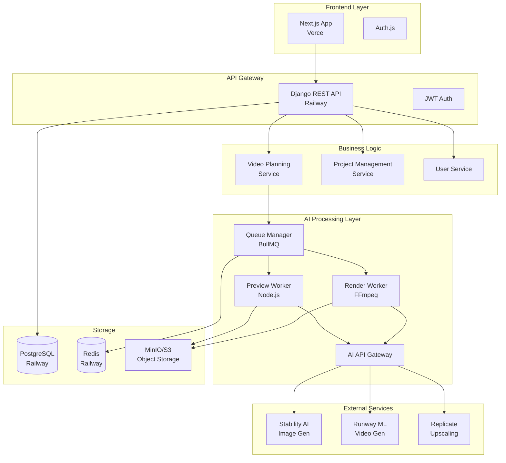

# Architecture Decision Record: AI 영상 생성 플랫폼 통합

## 제목 및 상태
- **제목**: VideoPlanet AI 영상 생성 플랫폼 아키텍처 설계
- **상태**: PROPOSED
- **날짜**: 2025-01-09
- **결정자**: Arthur (Chief Architect)

## 1. 컨텍스트 및 문제 정의

### 1.1 비즈니스 컨텍스트
VideoPlanet은 현재 영상 제작 프로젝트 관리 플랫폼으로서, AI 기반 영상 생성 기능을 추가하여 서비스를 확장하고자 합니다. 목표는 사용자가 스토리를 기획하고 AI를 통해 6초 1080p 영상을 생성하는 End-to-End 솔루션을 제공하는 것입니다.

### 1.2 기술적 제약사항
- **기존 인프라**: Next.js (Frontend) + Django (Backend) + PostgreSQL
- **배포 환경**: Vercel (Frontend) + Railway (Backend)
- **원가 목표**: $2/6초 영상
- **품질 요구**: 1080p, 6초, 인물/배경 분리 합성

### 1.3 핵심 요구사항
1. **영상 기획**: 스토리 설계 및 프롬프트 작성
2. **AI 생성**: 프롬프트 → 미리보기 → 확정본 워크플로우
3. **영상 처리**: 인물/배경 분리, 합성, 업스케일, 보간
4. **상태 관리**: draft → planning → planned → previewing → completed

## 2. 의사결정 요인

### 2.1 품질 속성 우선순위
1. **확장성 (Scalability)**: 동시 생성 요청 100개 이상 처리
2. **비용 효율성 (Cost Efficiency)**: $2/6초 목표 달성
3. **안정성 (Reliability)**: 99.9% 가용성, 실패 시 자동 재시도
4. **성능 (Performance)**: 미리보기 30초 이내, 최종본 5분 이내
5. **유지보수성 (Maintainability)**: 모듈화된 구조, 명확한 경계

### 2.2 제약사항
- 기존 VideoPlanet 인프라와의 통합 필수
- Django JWT 인증 체계 유지
- Railway 배포 환경 제약 (Docker 지원, 메모리 제한)
- 초기 개발 기간 2주

## 3. 고려된 옵션

### Option 1: 완전 통합 모놀리스
```
┌──────────────────────────────────────┐
│         Django Monolith              │
│  ┌──────────┐  ┌──────────────────┐ │
│  │  기존    │  │   AI Video       │ │
│  │  기능    │  │   Generation     │ │
│  └──────────┘  └──────────────────┘ │
└──────────────────────────────────────┘
```
- **장점**: 단순한 배포, 일관된 코드베이스
- **단점**: 확장성 제한, AI 워크로드가 기존 서비스 영향

### Option 2: 마이크로서비스 (선택됨) ✅
```
┌─────────────┐   ┌──────────────┐   ┌──────────────┐
│   Next.js   │──▶│   Django     │──▶│  AI Worker   │
│   Frontend  │   │   Backend    │   │   Service    │
└─────────────┘   └──────────────┘   └──────────────┘
                          │                  │
                          ▼                  ▼
                    ┌──────────┐      ┌──────────┐
                    │PostgreSQL│      │  Redis   │
                    └──────────┘      └──────────┘
```
- **장점**: 독립적 확장, 장애 격리, 기술 스택 유연성
- **단점**: 복잡도 증가, 네트워크 오버헤드

### Option 3: Serverless Functions
- **장점**: 자동 확장, 사용량 기반 과금
- **단점**: Cold start 문제, 5분 제한, 상태 관리 복잡

## 4. 결정 결과

### 4.1 선택: Option 2 - 제한적 마이크로서비스 아키텍처

**하이브리드 접근**: 기존 Django 백엔드를 확장하되, AI 워크로드는 별도 워커 서비스로 분리

### 4.2 시스템 아키텍처



### 4.3 기술 스택 매핑

| 컴포넌트 | 현재 | AI 플랫폼 통합 후 | 근거 |
|---------|------|----------------|------|
| Frontend | Next.js 15.1 | 동일 + AI Studio UI | 기존 활용 |
| Auth | Django JWT | 동일 + Auth.js 래퍼 | 일관성 |
| API | Django REST | 동일 + GraphQL 고려 | 점진적 마이그레이션 |
| Queue | 없음 | BullMQ + Redis | 비동기 처리 필수 |
| Worker | 없음 | Node.js Worker Pool | FFmpeg 통합 용이 |
| Storage | PostgreSQL | PostgreSQL + MinIO | 대용량 파일 처리 |
| Cache | 없음 | Redis | 성능 최적화 |

### 4.4 데이터 모델 확장

```python
# Django Models
class AIVideoProject(models.Model):
    project = models.ForeignKey(Project, on_delete=models.CASCADE)
    status = models.CharField(choices=STATUS_CHOICES)  # draft, planning, planned, previewing, completed
    story_script = models.TextField()
    ai_prompt = models.JSONField()
    preview_url = models.URLField(null=True)
    final_url = models.URLField(null=True)
    generation_params = models.JSONField()
    cost_estimate = models.DecimalField(max_digits=10, decimal_places=2)
    created_at = models.DateTimeField(auto_now_add=True)
    
class GenerationJob(models.Model):
    video_project = models.ForeignKey(AIVideoProject, on_delete=models.CASCADE)
    job_type = models.CharField(choices=['preview', 'final'])
    status = models.CharField(choices=['queued', 'processing', 'completed', 'failed'])
    worker_id = models.CharField(max_length=100, null=True)
    started_at = models.DateTimeField(null=True)
    completed_at = models.DateTimeField(null=True)
    error_message = models.TextField(null=True)
    retry_count = models.IntegerField(default=0)
```

## 5. 구현 전략

### 5.1 Phase 1: 기반 구축 (Day 1-3)
```javascript
// 1. Queue 시스템 구축
const Queue = require('bullmq');
const videoQueue = new Queue('video-generation', {
  connection: redis,
  defaultJobOptions: {
    attempts: 3,
    backoff: { type: 'exponential', delay: 2000 }
  }
});

// 2. Worker Pool 설정
const workerPool = {
  preview: new Worker('preview', previewProcessor, { concurrency: 5 }),
  render: new Worker('render', renderProcessor, { concurrency: 2 })
};

// 3. Storage 추상화
class StorageService {
  async uploadToS3(file, bucket) { /* MinIO 업로드 */ }
  async getSignedUrl(key, expires) { /* 임시 URL 생성 */ }
}
```

### 5.2 Phase 2: AI 통합 (Day 4-7)
```typescript
// AI Service 추상화 레이어
interface AIProvider {
  generateImage(prompt: string): Promise<Buffer>;
  generateVideo(images: Buffer[], params: VideoParams): Promise<Buffer>;
  upscale(video: Buffer, targetResolution: string): Promise<Buffer>;
}

class AIOrchestrator {
  private providers: Map<string, AIProvider>;
  
  async generatePreview(prompt: AIPrompt): Promise<PreviewResult> {
    // 1. 인물 생성
    const character = await this.providers.get('stability').generateImage(prompt.character);
    
    // 2. 배경 생성
    const background = await this.providers.get('stability').generateImage(prompt.background);
    
    // 3. 합성 및 애니메이션
    const composited = await this.composite(character, background);
    const animated = await this.providers.get('runway').generateVideo([composited]);
    
    // 4. 업스케일 (옵션)
    if (params.upscale) {
      return await this.providers.get('replicate').upscale(animated, '1080p');
    }
    
    return animated;
  }
}
```

### 5.3 Phase 3: 통합 및 최적화 (Day 8-10)
```python
# Django View 통합
class AIVideoViewSet(viewsets.ModelViewSet):
    @action(detail=True, methods=['post'])
    def generate_preview(self, request, pk=None):
        video_project = self.get_object()
        
        # 1. Job 생성
        job = GenerationJob.objects.create(
            video_project=video_project,
            job_type='preview',
            status='queued'
        )
        
        # 2. Queue에 추가
        queue_service.add_job({
            'job_id': job.id,
            'type': 'preview',
            'prompt': video_project.ai_prompt,
            'params': video_project.generation_params
        })
        
        # 3. WebSocket으로 실시간 알림
        channel_layer.group_send(
            f'video_{video_project.id}',
            {'type': 'status_update', 'status': 'processing'}
        )
        
        return Response({'job_id': job.id, 'status': 'queued'})
```

## 6. 위험 요소 및 완화 전략

### 6.1 기술적 위험

| 위험 | 영향도 | 확률 | 완화 전략 |
|-----|--------|------|-----------|
| AI API 비용 초과 | 높음 | 중간 | - 사용량 제한 설정<br/>- 프리뷰는 저해상도<br/>- 캐싱 적극 활용 |
| 처리 시간 초과 | 중간 | 높음 | - 병렬 처리 최대화<br/>- 점진적 렌더링<br/>- 사용자 알림 시스템 |
| 스토리지 부족 | 중간 | 중간 | - 자동 정리 정책<br/>- CDN 활용<br/>- 압축 알고리즘 |
| Worker 장애 | 높음 | 낮음 | - Health check<br/>- 자동 재시작<br/>- 다중 Worker 인스턴스 |

### 6.2 비즈니스 위험

| 위험 | 완화 전략 |
|-----|-----------|
| 품질 미달 | - A/B 테스트를 통한 모델 선택<br/>- 사용자 피드백 루프 구축 |
| 저작권 문제 | - 생성 콘텐츠 필터링<br/>- 이용약관 명시 |
| 확장성 한계 | - 클라우드 네이티브 설계<br/>- 오토스케일링 준비 |

## 7. 성능 목표 및 모니터링

### 7.1 SLA 목표
- **가용성**: 99.9% (월 43분 다운타임 허용)
- **응답시간**: P50 < 200ms, P99 < 1s (API)
- **처리시간**: 프리뷰 < 30초, 최종본 < 5분
- **동시처리**: 100개 요청 동시 처리

### 7.2 모니터링 지표
```typescript
// 핵심 메트릭
const metrics = {
  // 비즈니스 메트릭
  generationRequests: new Counter('video_generation_requests_total'),
  generationDuration: new Histogram('video_generation_duration_seconds'),
  generationCost: new Gauge('video_generation_cost_dollars'),
  
  // 기술 메트릭
  queueDepth: new Gauge('queue_depth'),
  workerUtilization: new Gauge('worker_utilization_percent'),
  apiLatency: new Histogram('external_api_latency_seconds'),
  
  // 에러 메트릭
  failureRate: new Counter('generation_failures_total'),
  retryCount: new Counter('generation_retries_total')
};
```

## 8. 마이그레이션 전략

### 8.1 단계별 롤아웃
1. **Alpha (Week 1)**: 내부 테스트, 기본 기능만
2. **Beta (Week 2)**: 선택된 사용자 그룹, 피드백 수집
3. **GA (Week 3)**: 전체 사용자, 점진적 활성화

### 8.2 롤백 계획
- Feature flag를 통한 즉시 비활성화
- 데이터베이스 마이그레이션 되돌리기 스크립트
- 이전 버전 Docker 이미지 보관

## 9. 비용 분석

### 9.1 예상 비용 구조 (6초 영상 기준)
| 항목 | 비용 | 설명 |
|------|------|------|
| AI API | $1.20 | Stability AI + Runway ML |
| 컴퓨팅 | $0.30 | Worker 처리 시간 |
| 스토리지 | $0.10 | S3/CDN |
| 네트워크 | $0.05 | 데이터 전송 |
| 오버헤드 | $0.35 | 실패/재시도, 관리 |
| **총계** | **$2.00** | 목표 달성 |

### 9.2 최적화 기회
- 배치 처리로 API 호출 최소화
- 캐싱으로 중복 생성 방지
- 오프피크 시간 활용으로 비용 절감

## 10. 결론 및 다음 단계

### 10.1 결론
제한적 마이크로서비스 아키텍처를 통해 기존 VideoPlanet 플랫폼의 안정성을 유지하면서 AI 영상 생성 기능을 효과적으로 통합할 수 있습니다. 이 접근 방식은 확장성, 비용 효율성, 그리고 개발 속도 간의 균형을 제공합니다.

### 10.2 즉시 실행 사항
1. Redis 인스턴스 프로비저닝 (Railway)
2. Worker 서비스 Docker 이미지 준비
3. MinIO/S3 버킷 설정
4. AI API 키 획득 및 테스트

### 10.3 검증 체크포인트
- [ ] Day 3: Queue 시스템 동작 확인
- [ ] Day 7: 첫 프리뷰 생성 성공
- [ ] Day 10: End-to-end 워크플로우 완성
- [ ] Day 14: 프로덕션 배포 준비 완료

---

**승인**: _______________  
**날짜**: 2025-01-09  
**다음 리뷰**: 2025-01-16