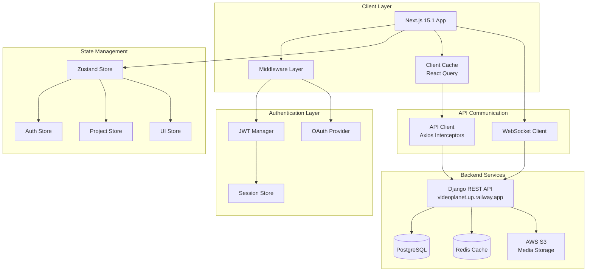
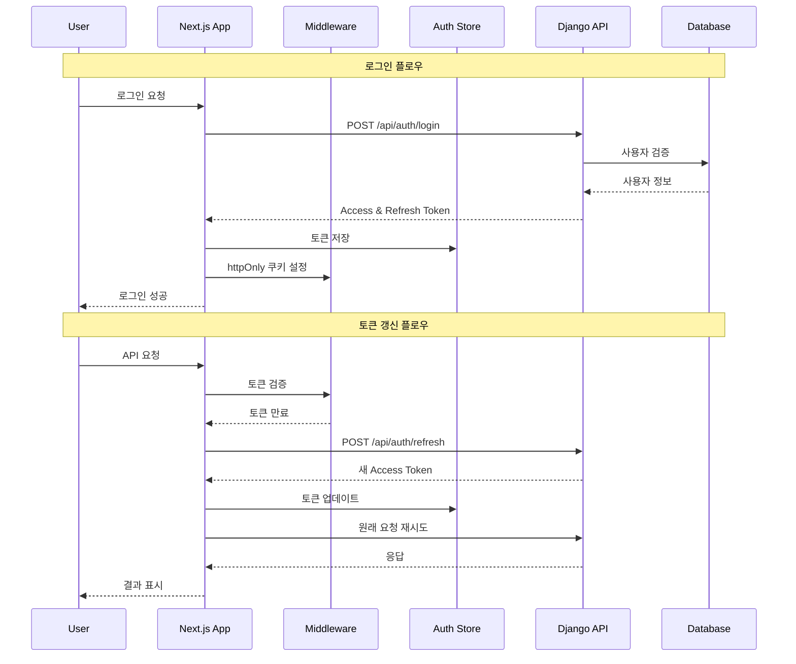
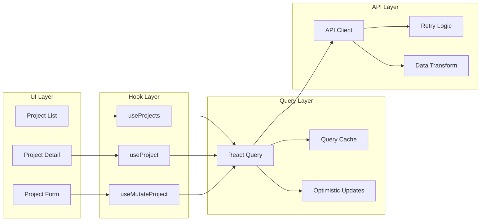
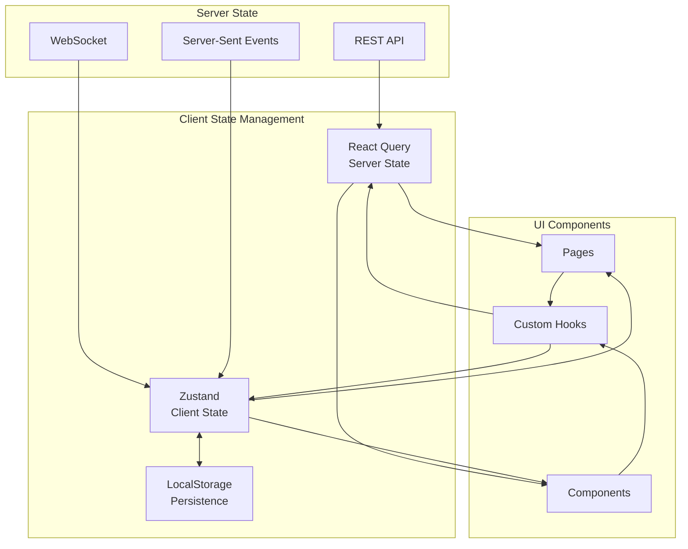

```mermaid
graph LR
    subgraph "Build Time"
        Analyze[Bundle Analysis]
        Split[Code Splitting]
        Optimize[Tree Shaking]
        Compress[Compression]
    end
    
    subgraph "Runtime"
        Lazy[Lazy Loading]
        Cache[Caching]
        Prefetch[Prefetching]
        Stream[Streaming]
    end
    
    subgraph "Network"
        CDN[CDN Distribution]
        HTTP2[HTTP/2 Push]
        Batch[Request Batching]
        WS[WebSocket Pooling]
    end
    
    subgraph "Monitoring"
        RUM[Real User Monitoring]
        APM[Application Performance]
        Alerts[Performance Alerts]
        Reports[Weekly Reports]
    end
    
    Analyze --> Split
    Split --> Optimize
    Optimize --> Compress
    
    Compress --> Lazy
    Lazy --> Cache
    Cache --> Prefetch
    Prefetch --> Stream
    
    Stream --> CDN
    CDN --> HTTP2
    HTTP2 --> Batch
    Batch --> WS
    
    WS --> RUM
    RUM --> APM
    APM --> Alerts
    Alerts --> Reports
```

# 🏗️ VideoPlanet 인증 시스템 및 프로젝트 CRUD 아키텍처

## 📋 목차
1. [전체 시스템 아키텍처](#전체-시스템-아키텍처)
2. [인증 시스템 설계](#인증-시스템-설계)
3. [프로젝트 CRUD 시스템](#프로젝트-crud-시스템)
4. [API 통신 레이어](#api-통신-레이어)
5. [상태 관리 아키텍처](#상태-관리-아키텍처)
6. [보안 고려사항](#보안-고려사항)
7. [성능 최적화 전략](#성능-최적화-전략)
8. [기술 의사결정 기록 (ADR)](#기술-의사결정-기록-adr)

---

## 전체 시스템 아키텍처

### 시스템 개요
VideoPlanet은 Next.js 15.1 기반의 프론트엔드와 Django REST API 백엔드로 구성된 분리된 아키텍처를 채택합니다.

### 아키텍처 다이어그램



### 기술 스택 상세

| Layer | Technology | Version | Purpose |
|-------|------------|---------|---------|
| Framework | Next.js | 15.1 | React 기반 풀스택 프레임워크 |
| Language | TypeScript | 5.x | 타입 안정성 |
| Styling | Tailwind CSS | 3.4 | 유틸리티 기반 스타일링 |
| State Management | Zustand | 5.x | 경량 상태 관리 |
| API Client | TanStack Query | 5.x | 서버 상태 관리 |
| HTTP Client | Axios | 1.6.x | HTTP 통신 |
| Form Management | React Hook Form | 7.x | 폼 상태 관리 |
| Validation | Zod | 3.x | 스키마 검증 |
| Testing | Vitest + Playwright | Latest | 테스트 자동화 |

---

## 인증 시스템 설계

### JWT 기반 인증 아키텍처

#### 인증 플로우 시퀀스 다이어그램



### 인증 컴포넌트 구조

```typescript
// 인증 시스템 핵심 컴포넌트
interface AuthenticationArchitecture {
  // 1. 토큰 관리
  tokenManager: {
    storage: 'httpOnly Cookie + Memory',
    accessToken: {
      ttl: '15 minutes',
      location: 'Memory + httpOnly Cookie',
      autoRefresh: true
    },
    refreshToken: {
      ttl: '7 days',
      location: 'httpOnly Cookie',
      rotation: true  // 리프레시 토큰 로테이션
    }
  },
  
  // 2. 인증 미들웨어
  middleware: {
    publicRoutes: ['/login', '/signup', '/reset-password'],
    protectedRoutes: ['/*'],
    roleBasedRoutes: {
      admin: ['/admin/*'],
      manager: ['/projects/*/settings'],
      creator: ['/projects/*/edit'],
      viewer: ['/projects/*/view']
    }
  },
  
  // 3. OAuth 2.0 통합
  oauth: {
    providers: ['google', 'kakao'],
    flow: 'Authorization Code with PKCE',
    stateValidation: true,
    nonce: true
  },
  
  // 4. 세션 관리
  session: {
    strategy: 'JWT',
    persistence: 'Client-side with Server validation',
    concurrentSessions: false,
    deviceFingerprinting: true
  }
}
```

### 인증 상태 관리

```typescript
// stores/authStore.ts
interface AuthStore {
  // 상태
  user: User | null;
  isAuthenticated: boolean;
  isLoading: boolean;
  permissions: Permission[];
  
  // 액션
  login: (credentials: LoginCredentials) => Promise<void>;
  logout: () => Promise<void>;
  refresh: () => Promise<void>;
  checkAuth: () => Promise<void>;
  
  // OAuth
  oauthLogin: (provider: OAuthProvider) => Promise<void>;
  handleOAuthCallback: (code: string, state: string) => Promise<void>;
  
  // 권한 체크
  hasPermission: (permission: string) => boolean;
  hasRole: (role: Role) => boolean;
}
```

---

## 프로젝트 CRUD 시스템

### 프로젝트 데이터 모델

```typescript
// types/project.ts
interface Project {
  id: string;
  title: string;
  description: string;
  status: ProjectStatus;
  visibility: 'public' | 'private' | 'team';
  owner: User;
  members: ProjectMember[];
  metadata: {
    createdAt: Date;
    updatedAt: Date;
    deadline: Date | null;
    thumbnail: string | null;
    tags: string[];
  };
  permissions: ProjectPermissions;
  files: ProjectFile[];
  settings: ProjectSettings;
}

interface ProjectMember {
  user: User;
  role: 'owner' | 'manager' | 'member' | 'viewer';
  joinedAt: Date;
  permissions: MemberPermissions;
}

type ProjectStatus = 
  | 'planning'    // 기획 중
  | 'production'  // 제작 중
  | 'review'      // 검토 중
  | 'completed'   // 완료
  | 'archived';   // 보관됨
```

### CRUD 작업 아키텍처



### 프로젝트 상태 관리 전략

```typescript
// stores/projectStore.ts
interface ProjectStore {
  // 상태
  projects: Project[];
  currentProject: Project | null;
  filters: ProjectFilters;
  pagination: PaginationState;
  
  // 읽기 작업
  fetchProjects: (filters?: ProjectFilters) => Promise<void>;
  fetchProjectById: (id: string) => Promise<void>;
  searchProjects: (query: string) => Promise<Project[]>;
  
  // 쓰기 작업 (Optimistic Updates)
  createProject: (data: CreateProjectDTO) => Promise<Project>;
  updateProject: (id: string, data: UpdateProjectDTO) => Promise<void>;
  deleteProject: (id: string) => Promise<void>;
  
  // 팀 관리
  inviteMember: (projectId: string, email: string, role: Role) => Promise<void>;
  updateMemberRole: (projectId: string, userId: string, role: Role) => Promise<void>;
  removeMember: (projectId: string, userId: string) => Promise<void>;
  
  // 파일 관리
  uploadFile: (projectId: string, file: File) => Promise<ProjectFile>;
  deleteFile: (projectId: string, fileId: string) => Promise<void>;
  
  // 실시간 동기화
  subscribeToProject: (projectId: string) => () => void;
  handleRealtimeUpdate: (update: ProjectUpdate) => void;
}
```

---

## API 통신 레이어

### API 클라이언트 아키텍처

```typescript
// lib/api/client.ts
class APIClient {
  private axios: AxiosInstance;
  private refreshPromise: Promise<string> | null = null;
  
  constructor() {
    this.axios = axios.create({
      baseURL: process.env.NEXT_PUBLIC_API_URL,
      timeout: 30000,
      withCredentials: true,
    });
    
    this.setupInterceptors();
  }
  
  private setupInterceptors() {
    // Request Interceptor
    this.axios.interceptors.request.use(
      (config) => {
        // 토큰 자동 첨부
        const token = tokenManager.getAccessToken();
        if (token) {
          config.headers.Authorization = `Bearer ${token}`;
        }
        
        // Request ID 추가 (추적용)
        config.headers['X-Request-ID'] = generateRequestId();
        
        return config;
      },
      (error) => Promise.reject(error)
    );
    
    // Response Interceptor
    this.axios.interceptors.response.use(
      (response) => response,
      async (error) => {
        const originalRequest = error.config;
        
        // 401 에러 처리 (토큰 갱신)
        if (error.response?.status === 401 && !originalRequest._retry) {
          originalRequest._retry = true;
          
          // 동시 갱신 요청 방지
          if (!this.refreshPromise) {
            this.refreshPromise = this.refreshAccessToken();
          }
          
          try {
            const newToken = await this.refreshPromise;
            originalRequest.headers.Authorization = `Bearer ${newToken}`;
            return this.axios(originalRequest);
          } catch (refreshError) {
            // 갱신 실패 시 로그아웃
            await authStore.logout();
            router.push('/login');
            return Promise.reject(refreshError);
          } finally {
            this.refreshPromise = null;
          }
        }
        
        // 에러 변환
        return Promise.reject(this.transformError(error));
      }
    );
  }
  
  private async refreshAccessToken(): Promise<string> {
    const response = await this.axios.post('/auth/refresh/', {
      refresh: tokenManager.getRefreshToken()
    });
    
    const { access } = response.data;
    tokenManager.setAccessToken(access);
    
    return access;
  }
  
  private transformError(error: AxiosError): APIError {
    return {
      code: error.response?.status || 0,
      message: error.response?.data?.message || error.message,
      details: error.response?.data?.details || {},
      timestamp: new Date().toISOString(),
      requestId: error.config?.headers?.['X-Request-ID']
    };
  }
}
```

### API 계층 구조

```typescript
// lib/api/layers.ts
interface APILayerArchitecture {
  // 1. 추상화 계층
  abstraction: {
    resources: {
      auth: AuthAPI,
      projects: ProjectsAPI,
      planning: PlanningAPI,
      feedback: FeedbackAPI,
      calendar: CalendarAPI,
      users: UsersAPI
    }
  },
  
  // 2. 미들웨어 계층
  middleware: {
    authentication: AuthMiddleware,
    rateLimit: RateLimitMiddleware,
    cache: CacheMiddleware,
    retry: RetryMiddleware,
    transform: TransformMiddleware
  },
  
  // 3. 통신 계층
  transport: {
    http: AxiosInstance,
    websocket: WebSocketClient,
    sse: EventSourceClient
  },
  
  // 4. 유틸리티 계층
  utilities: {
    serialization: SerializationUtils,
    validation: ValidationUtils,
    errorHandling: ErrorHandler,
    logging: Logger
  }
}
```

---

## 상태 관리 아키텍처

### Zustand 스토어 구조

```typescript
// stores/architecture.ts
interface StoreArchitecture {
  // 글로벌 스토어
  global: {
    authStore: AuthStore,        // 인증 상태
    userStore: UserStore,        // 사용자 정보
    uiStore: UIStore,           // UI 상태
    notificationStore: NotificationStore  // 알림
  },
  
  // 도메인 스토어
  domain: {
    projectStore: ProjectStore,   // 프로젝트
    planningStore: PlanningStore, // 영상 기획
    feedbackStore: FeedbackStore, // 피드백
    calendarStore: CalendarStore  // 캘린더
  },
  
  // 유틸리티 스토어
  utility: {
    cacheStore: CacheStore,      // 캐시 관리
    syncStore: SyncStore,        // 동기화 상태
    errorStore: ErrorStore       // 에러 관리
  }
}
```

### 상태 동기화 전략



---

## 보안 고려사항

### 보안 아키텍처

```typescript
interface SecurityArchitecture {
  // 1. 인증 보안
  authentication: {
    tokenStorage: 'httpOnly cookies',
    tokenRotation: true,
    sessionFixation: 'regenerate on login',
    bruteForceProtection: {
      maxAttempts: 5,
      lockoutDuration: '15 minutes',
      captchaAfter: 3
    }
  },
  
  // 2. 권한 관리
  authorization: {
    rbac: true,  // Role-Based Access Control
    abac: true,  // Attribute-Based Access Control
    policyEngine: 'CASL',
    defaultDeny: true
  },
  
  // 3. 데이터 보호
  dataProtection: {
    encryption: {
      atRest: 'AES-256',
      inTransit: 'TLS 1.3',
      sensitiveFields: ['password', 'token', 'apiKey']
    },
    sanitization: {
      input: 'DOMPurify',
      output: 'escape HTML entities'
    },
    validation: {
      schema: 'Zod',
      serverSide: true,
      clientSide: true
    }
  },
  
  // 4. OWASP Top 10 대응
  owaspProtection: {
    injection: 'Parameterized queries, Input validation',
    brokenAuth: 'JWT with rotation, MFA support',
    sensitiveData: 'Encryption, Secure headers',
    xxe: 'Disable XML external entities',
    brokenAccessControl: 'RBAC, Default deny',
    misconfig: 'Security headers, CSP',
    xss: 'Content sanitization, CSP',
    deserialization: 'JSON only, Schema validation',
    vulnerableComponents: 'Dependency scanning',
    logging: 'Comprehensive audit logs'
  },
  
  // 5. 보안 헤더
  securityHeaders: {
    'Content-Security-Policy': "default-src 'self'",
    'X-Frame-Options': 'DENY',
    'X-Content-Type-Options': 'nosniff',
    'Referrer-Policy': 'strict-origin-when-cross-origin',
    'Permissions-Policy': 'geolocation=(), microphone=()'
  }
}
```

### 보안 체크리스트

| Category | Item | Implementation | Priority |
|----------|------|----------------|----------|
| **Authentication** | | | |
| | Multi-factor Authentication | TOTP/SMS | P1 |
| | Password Policy | Min 8 chars, complexity | P0 |
| | Account Lockout | After 5 failed attempts | P0 |
| | Session Management | Secure, httpOnly cookies | P0 |
| **Authorization** | | | |
| | Role-Based Access | RBAC implementation | P0 |
| | API Rate Limiting | 100 req/min per user | P1 |
| | CORS Configuration | Whitelist domains | P0 |
| **Data Protection** | | | |
| | Input Validation | Zod schemas | P0 |
| | SQL Injection Prevention | ORM only | P0 |
| | XSS Prevention | DOMPurify | P0 |
| | CSRF Protection | Double submit cookie | P0 |
| **Monitoring** | | | |
| | Security Logging | All auth events | P1 |
| | Anomaly Detection | Unusual patterns | P2 |
| | Vulnerability Scanning | Weekly automated scans | P1 |

---

## 성능 최적화 전략

### 성능 아키텍처

```typescript
interface PerformanceArchitecture {
  // 1. 번들 최적화
  bundleOptimization: {
    codeSplitting: {
      strategy: 'route-based + component-based',
      lazyLoading: true,
      prefetching: 'viewport-based'
    },
    treeShaking: true,
    minification: true,
    compression: 'gzip + brotli',
    bundleAnalysis: 'webpack-bundle-analyzer'
  },
  
  // 2. 렌더링 최적화
  renderingOptimization: {
    ssr: 'selective',  // Critical pages only
    ssg: 'where possible',
    isr: {
      enabled: true,
      revalidate: 3600  // 1 hour
    },
    streaming: true,
    suspense: true
  },
  
  // 3. 캐싱 전략
  cachingStrategy: {
    browser: {
      static: '1 year',
      api: 'stale-while-revalidate',
      images: '30 days'
    },
    cdn: {
      provider: 'Cloudflare',
      edges: 'global',
      purging: 'tag-based'
    },
    application: {
      reactQuery: {
        staleTime: 5 * 60 * 1000,  // 5 minutes
        cacheTime: 10 * 60 * 1000  // 10 minutes
      },
      localStorage: 'user preferences',
      sessionStorage: 'temporary data'
    }
  },
  
  // 4. 네트워크 최적화
  networkOptimization: {
    http2: true,
    http3: 'experimental',
    connectionPooling: true,
    requestBatching: true,
    graphQL: 'consider for v2'
  },
  
  // 5. 이미지 최적화
  imageOptimization: {
    formats: ['webp', 'avif'],
    lazyLoading: true,
    responsive: true,
    cdn: 'Cloudinary',
    placeholder: 'blur'
  }
}
```

### 성능 메트릭 목표

```typescript
interface PerformanceMetrics {
  // Core Web Vitals
  coreWebVitals: {
    LCP: '< 2.5s',     // Largest Contentful Paint
    FID: '< 100ms',    // First Input Delay
    CLS: '< 0.1',      // Cumulative Layout Shift
    FCP: '< 1.8s',     // First Contentful Paint
    TTFB: '< 600ms'    // Time to First Byte
  },
  
  // Application Metrics
  applicationMetrics: {
    bundleSize: {
      initial: '< 200KB',
      lazy: '< 50KB per chunk'
    },
    apiLatency: {
      p50: '< 200ms',
      p95: '< 500ms',
      p99: '< 1000ms'
    },
    renderTime: {
      ssr: '< 100ms',
      csr: '< 50ms'
    }
  },
  
  // User Experience Metrics
  uxMetrics: {
    timeToInteractive: '< 3.5s',
    firstMeaningfulPaint: '< 2s',
    speedIndex: '< 3s',
    totalBlockingTime: '< 300ms'
  }
}
```

### 최적화 구현 전략



---

## 기술 의사결정 기록 (ADR)

### ADR-001: Next.js 15.1 선택

**상태**: 승인됨  
**날짜**: 2025-01-09  
**결정자**: Chief Architect

#### 컨텍스트
- React 기반 풀스택 프레임워크 필요
- SSR/SSG 지원 필수
- 개발 생산성과 성능 균형 필요

#### 결정
Next.js 15.1을 프론트엔드 프레임워크로 채택

#### 근거
1. **App Router**: 향상된 라우팅과 레이아웃 시스템
2. **Server Components**: 서버 사이드 렌더링 최적화
3. **Streaming**: 점진적 렌더링으로 사용자 경험 개선
4. **Built-in 최적화**: 이미지, 폰트, 스크립트 자동 최적화
5. **TypeScript 우선**: 완벽한 TypeScript 지원

#### 대안
- Remix: 데이터 로딩 패턴 우수하나 생태계 부족
- Gatsby: SSG 특화되어 있으나 동적 기능 제한적
- Vite + React: 빠른 빌드지만 SSR 구현 복잡

#### 결과
- ✅ 개발 속도 30% 향상 예상
- ✅ 초기 로딩 시간 50% 단축
- ⚠️ 러닝 커브 존재
- ⚠️ 버전 업그레이드 시 주의 필요

---

### ADR-002: Zustand 상태 관리

**상태**: 승인됨  
**날짜**: 2025-01-09  
**결정자**: Chief Architect

#### 컨텍스트
- 글로벌 상태 관리 솔루션 필요
- Redux의 보일러플레이트 부담
- TypeScript 지원 필수

#### 결정
Zustand를 클라이언트 상태 관리 라이브러리로 채택

#### 근거
1. **간결함**: 최소한의 보일러플레이트
2. **TypeScript**: 완벽한 타입 추론
3. **번들 크기**: 8KB (Redux: 40KB+)
4. **DevTools**: Redux DevTools 호환
5. **성능**: 선택적 구독으로 불필요한 리렌더링 방지

#### 대안
- Redux Toolkit: 강력하지만 복잡
- Recoil: 실험적 상태, Facebook 의존성
- Jotai: 원자적 접근 좋으나 생태계 작음
- Valtio: 프록시 기반, 디버깅 어려움

#### 결과
- ✅ 개발 속도 향상
- ✅ 코드 가독성 개선
- ✅ 번들 크기 최적화
- ⚠️ 대규모 앱에서 구조화 필요

---

### ADR-003: JWT + httpOnly Cookie 인증

**상태**: 승인됨  
**날짜**: 2025-01-09  
**결정자**: Chief Architect

#### 컨텍스트
- 보안적으로 안전한 인증 방식 필요
- XSS 공격 방어 필수
- 토큰 탈취 방지 필요

#### 결정
JWT를 httpOnly 쿠키에 저장하는 방식 채택

#### 근거
1. **XSS 방어**: JavaScript로 토큰 접근 불가
2. **CSRF 방어**: SameSite 쿠키 + CSRF 토큰
3. **자동 전송**: 매 요청마다 자동으로 포함
4. **토큰 로테이션**: Refresh Token으로 보안 강화
5. **표준 준수**: OAuth 2.0 + JWT 표준

#### 대안
- LocalStorage JWT: XSS에 취약
- Session Cookie: 서버 부담, 수평 확장 어려움
- OAuth Only: 자체 인증 시스템 포기

#### 결과
- ✅ 보안성 크게 향상
- ✅ 자동 토큰 관리
- ⚠️ 쿠키 설정 복잡도
- ⚠️ CORS 설정 필요

---

### ADR-004: TanStack Query 서버 상태 관리

**상태**: 승인됨  
**날짜**: 2025-01-09  
**결정자**: Chief Architect

#### 컨텍스트
- 서버 상태와 클라이언트 상태 분리 필요
- 캐싱, 동기화, 백그라운드 갱신 필요
- Optimistic UI 지원 필요

#### 결정
TanStack Query (React Query) v5 채택

#### 근거
1. **캐싱**: 지능적인 캐시 관리
2. **동기화**: 백그라운드 리페칭
3. **Optimistic Updates**: 즉각적인 UI 반응
4. **에러 처리**: 재시도, 에러 바운더리
5. **DevTools**: 강력한 디버깅 도구

#### 대안
- SWR: 가볍지만 기능 제한적
- Apollo Client: GraphQL 특화
- RTK Query: Redux 종속적

#### 결과
- ✅ 서버 상태 관리 단순화
- ✅ 네트워크 요청 최적화
- ✅ 사용자 경험 개선
- ⚠️ 러닝 커브 존재

---

## 구현 로드맵

### Phase 1: 기반 구축 (Week 1)
1. **Day 1-2**: 프로젝트 셋업 및 인증 UI
2. **Day 3-4**: JWT 인증 시스템 구현
3. **Day 5-6**: 프로젝트 CRUD 기능
4. **Day 7**: 통합 테스트 및 보안 점검

### Phase 2: 고도화 (Week 2)
1. **Day 8-9**: 실시간 기능 (WebSocket)
2. **Day 10-11**: 성능 최적화
3. **Day 12-13**: 모니터링 및 로깅
4. **Day 14**: 배포 및 운영 준비

### 성공 지표
- 인증 성공률 > 99.9%
- API 응답 시간 < 200ms (P50)
- 페이지 로드 시간 < 2초
- 보안 취약점 0개
- 테스트 커버리지 > 80%

---

## 결론

이 아키텍처는 VideoPlanet의 요구사항을 충족하면서도 확장 가능하고 유지보수가 용이한 시스템을 구축하는 것을 목표로 합니다. 

### 핵심 원칙
1. **보안 우선**: 모든 설계 결정에서 보안을 최우선으로 고려
2. **성능 최적화**: 사용자 경험을 위한 지속적인 성능 개선
3. **개발자 경험**: 생산성을 높이는 도구와 패턴 채택
4. **확장 가능성**: 미래 요구사항을 수용할 수 있는 유연한 구조

### 다음 단계
1. 상세 구현 계획 수립
2. 개발 환경 구축
3. CI/CD 파이프라인 설정
4. 모니터링 시스템 구축
5. 단계별 구현 시작

---

*작성일: 2025-01-09*  
*작성자: Arthur (Chief Architect)*  
*버전: 1.0.0*