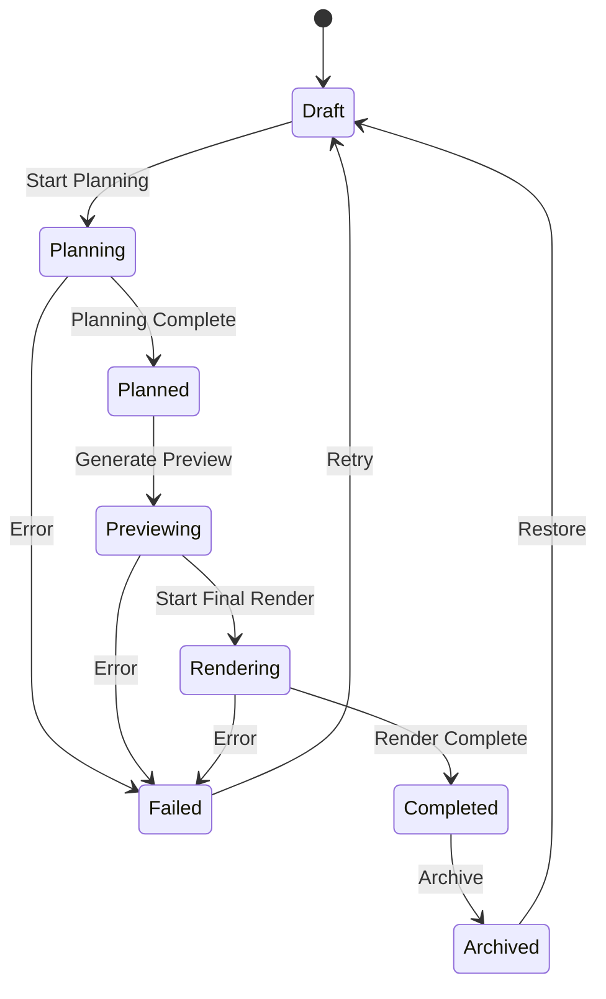

# AI Video SaaS Django 백엔드 통합 가이드

## 📋 아키텍처 설계 개요

### 1. 도메인 모델 구조 (Domain-Driven Design)

```
Story (Aggregate Root)
├── Scene (Entity)
│   └── ScenePrompt (Value Object)
├── Job (Entity)
└── StoryStateTransition (Event Log)
```

### 2. 상태 머신 (State Machine)



## 🚀 통합 단계

### Step 1: Django 설정 업데이트

1. **settings_base.py에 앱 추가**:
```python
INSTALLED_APPS = [
    # ... 기존 앱들
    'ai_video',  # AI Video Generation
]
```

2. **Redis 설정 추가**:
```python
# Redis Configuration for BullMQ
REDIS_HOST = env('REDIS_HOST', default='localhost')
REDIS_PORT = env('REDIS_PORT', default=6379)
REDIS_DB = env('REDIS_DB', default=0)

# Storage Configuration for MinIO
STORAGE_BASE_URL = env('STORAGE_BASE_URL', default='https://storage.videoplanet.com')
MINIO_ENDPOINT = env('MINIO_ENDPOINT', default='minio.railway.app')
MINIO_ACCESS_KEY = env('MINIO_ACCESS_KEY')
MINIO_SECRET_KEY = env('MINIO_SECRET_KEY')
MINIO_BUCKET = env('MINIO_BUCKET', default='videoplanet')
```

### Step 2: URL 라우팅 설정

**config/urls.py에 추가**:
```python
from django.urls import path, include

urlpatterns = [
    # ... 기존 URL 패턴들
    path('api/ai-video/', include('ai_video.urls')),
]
```

### Step 3: 데이터베이스 마이그레이션

```bash
cd /home/winnmedia/VideoPlanet/vridge_back
python manage.py makemigrations ai_video
python manage.py migrate ai_video
```

### Step 4: 초기 데이터 설정

```python
# Django shell에서 실행
from ai_video.models import AIProviderConfig, AIProvider

# Stability AI 설정
AIProviderConfig.objects.create(
    provider=AIProvider.STABILITY_AI,
    is_active=True,
    api_key='your-stability-ai-key',
    rate_limit_per_minute=60,
    rate_limit_per_hour=1000,
    cost_per_image=0.02,
    cost_per_second_video=0.05,
    settings={
        'default_model': 'stable-diffusion-xl-1024-v1-0',
        'default_steps': 30
    }
)

# Runway ML 설정
AIProviderConfig.objects.create(
    provider=AIProvider.RUNWAY_ML,
    is_active=True,
    api_key='your-runway-ml-key',
    rate_limit_per_minute=30,
    rate_limit_per_hour=500,
    cost_per_image=0.03,
    cost_per_second_video=0.08,
    settings={
        'default_model': 'gen-2',
        'max_duration': 4
    }
)
```

## 📡 API 엔드포인트

### Stories (프로젝트 관리)
- `GET /api/ai-video/stories/` - 스토리 목록
- `POST /api/ai-video/stories/` - 새 스토리 생성
- `GET /api/ai-video/stories/{id}/` - 스토리 상세
- `POST /api/ai-video/stories/{id}/transition/` - 상태 전환
- `POST /api/ai-video/stories/{id}/generate_preview/` - 프리뷰 생성
- `POST /api/ai-video/stories/{id}/render_final/` - 최종 렌더링

### Scenes (장면 관리)
- `GET /api/ai-video/scenes/` - 장면 목록
- `POST /api/ai-video/scenes/bulk_create/` - 장면 일괄 생성
- `POST /api/ai-video/scenes/{id}/generate/` - 장면 콘텐츠 생성
- `POST /api/ai-video/scenes/{id}/reorder/` - 장면 순서 변경

### Jobs (작업 모니터링)
- `GET /api/ai-video/jobs/` - 작업 목록
- `POST /api/ai-video/jobs/{id}/retry/` - 실패한 작업 재시도
- `POST /api/ai-video/jobs/{id}/cancel/` - 작업 취소
- `GET /api/ai-video/jobs/statistics/` - 작업 통계

## 🔧 Worker 통신 인터페이스

### BullMQ Job 구조
```javascript
{
  "id": "story_123_abc123",
  "name": "story_planning",
  "data": {
    "story_id": "uuid",
    "action": "plan_story",
    "parameters": {}
  },
  "opts": {
    "priority": 5,
    "attempts": 3,
    "backoff": {
      "type": "exponential",
      "delay": 2000
    }
  }
}
```

### Worker 응답 형식
```javascript
{
  "success": true,
  "result": {
    "preview_url": "https://...",
    "metadata": {},
    "generation_time": 5.2
  },
  "error": null
}
```

## 🔒 보안 및 권한

### 권한 클래스
- `IsOwnerOrReadOnly` - 소유자만 수정 가능
- `IsStoryOwner` - 스토리 소유자 확인
- `CanTransitionStory` - 상태 전환 권한
- `IsJobOwner` - 작업 소유자 확인

### API 인증
```python
# headers
{
    "Authorization": "Bearer {jwt_token}"
}
```

## 📊 비즈니스 로직 핵심

### 1. 상태 전환 검증
```python
def can_transition_to(self, new_status):
    transitions = {
        StoryStatus.DRAFT: [StoryStatus.PLANNING, StoryStatus.ARCHIVED],
        StoryStatus.PLANNING: [StoryStatus.PLANNED, StoryStatus.DRAFT, StoryStatus.FAILED],
        # ... 나머지 전환 규칙
    }
    return new_status in transitions.get(self.status, [])
```

### 2. 비용 계산
```python
def calculate_cost_estimate(story):
    scene_cost = scene_count * provider.cost_per_image
    video_cost = duration * provider.cost_per_second_video
    preview_cost = video_cost * 0.5
    storage_cost = 0.10
    return total_cost
```

### 3. 자동 장면 생성
```python
def auto_generate_scenes(story):
    scene_duration = 7  # 7초 단위
    num_scenes = story.duration_seconds // scene_duration
    # 장면 자동 생성 로직
```

## 🚦 프로덕션 체크리스트

### 필수 환경 변수
```env
# Redis
REDIS_HOST=redis.railway.app
REDIS_PORT=6379
REDIS_PASSWORD=your-password

# MinIO/S3
MINIO_ENDPOINT=minio.railway.app
MINIO_ACCESS_KEY=your-access-key
MINIO_SECRET_KEY=your-secret-key
MINIO_BUCKET=videoplanet

# AI Providers
STABILITY_AI_KEY=your-key
RUNWAY_ML_KEY=your-key
REPLICATE_API_TOKEN=your-token
```

### 성능 최적화
1. **쿼리 최적화**:
   - `prefetch_related()` 사용
   - `select_related()` 사용
   - 인덱스 추가

2. **캐싱 전략**:
   - Redis 캐싱
   - 프리뷰 이미지 CDN 캐싱
   - API 응답 캐싱

3. **비동기 처리**:
   - BullMQ 우선순위 큐
   - Worker Pool 자동 스케일링
   - 실패 작업 자동 재시도

## 📈 모니터링 및 로깅

### 주요 메트릭
- 평균 생성 시간
- 성공률
- API 비용 추적
- 큐 대기 시간

### 로그 레벨
```python
LOGGING = {
    'loggers': {
        'ai_video': {
            'level': 'INFO',
            'handlers': ['file', 'console'],
        }
    }
}
```

## 🧪 테스트 전략

### 단위 테스트
```python
# tests/test_state_machine.py
def test_story_state_transitions():
    story = Story.objects.create(...)
    assert story.can_transition_to(StoryStatus.PLANNING)
    story.transition_to(StoryStatus.PLANNING)
    assert story.status == StoryStatus.PLANNING
```

### 통합 테스트
```python
# tests/test_api.py
def test_story_workflow():
    # 1. 스토리 생성
    # 2. 장면 추가
    # 3. 프리뷰 생성
    # 4. 최종 렌더링
```

## 🚀 배포 단계

1. **데이터베이스 마이그레이션**
2. **Redis 인스턴스 프로비저닝**
3. **MinIO 버킷 생성**
4. **Worker 서비스 배포**
5. **API 키 설정**
6. **헬스 체크 설정**
7. **모니터링 대시보드 구성**

## 📞 지원 및 문서

- API 문서: `/api/ai-video/docs/`
- 관리자 패널: `/admin/ai_video/`
- 로그 위치: `/var/log/videoplanet/ai_video.log`

---

**작성일**: 2025-01-31
**버전**: 1.0.0
**담당**: Backend Lead (Benjamin)