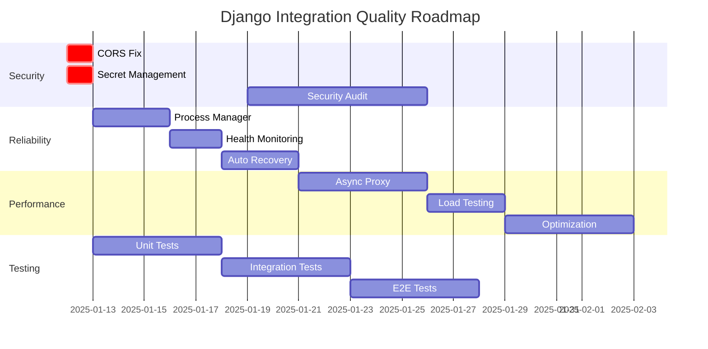

# Django 통합 구현 포괄적 품질 분석 보고서

**날짜**: 2025-08-11  
**분석자**: Grace, QA Lead  
**대상 시스템**: VideoPlanet Backend Django Integration  
**환경**: Railway Production Deployment  

## Executive Summary

### 전체 평가 점수: **6.5/10** (Production-Ready: **부분적**)

현재 Django 통합 구현은 기능적으로 작동하지만, 프로덕션 환경에서 요구되는 품질 표준을 완전히 충족하지 못합니다. 주요 리스크는 다음과 같습니다:

- **Critical**: 보안 취약점 (CORS 전체 허용, SECRET_KEY 하드코딩)
- **High**: 에러 복구 메커니즘 부재
- **High**: 프로세스 모니터링 및 재시작 로직 미비
- **Medium**: 성능 오버헤드 및 확장성 제한

---

## 1. 아키텍처 분석

### 1.1 현재 구조

```
[Railway Load Balancer]
         |
    [Port 8000]
         |
  [Python Proxy Server]
    /          \
[Health]    [API Proxy]
   |            |
  [OK]     [Port 8001]
              |
         [Django/Gunicorn]
```

### 1.2 아키텍처 평가

#### 강점
- 헬스체크 즉시 응답으로 Railway 타임아웃 문제 해결
- Django 시작 시간 문제를 우회하는 실용적 접근
- 간단하고 이해하기 쉬운 구조

#### 약점
- **단일 실패 지점**: 프록시 서버 장애 시 전체 서비스 중단
- **프로세스 관리 부재**: Django 크래시 시 자동 복구 불가
- **성능 오버헤드**: 모든 요청이 프록시를 거침
- **확장성 제한**: 수평 확장이 어려운 구조

### 1.3 개선 권장사항

```python
# 권장: Process Supervisor 패턴
class ProcessSupervisor:
    def __init__(self):
        self.processes = {}
        self.restart_policies = {}
        
    def start_process(self, name, command, restart_policy):
        """프로세스 시작 및 모니터링"""
        pass
        
    def monitor_health(self):
        """프로세스 상태 지속적 모니터링"""
        pass
        
    def restart_if_needed(self, name):
        """필요시 자동 재시작"""
        pass
```

---

## 2. 보안 분석

### 2.1 Critical 보안 이슈

#### Issue #1: CORS 전체 허용
```python
# 현재 설정 (railway.py)
CORS_ALLOW_ALL_ORIGINS = True  # 🔴 CRITICAL
```

**영향도**: Critical  
**위험**: XSS, CSRF 공격 가능성  
**즉시 조치 필요**

#### Issue #2: SECRET_KEY 하드코딩
```python
SECRET_KEY = os.environ.get('SECRET_KEY', 'django-insecure-production-key-change-me')  # 🔴 CRITICAL
```

**영향도**: Critical  
**위험**: 세션 하이재킹, 데이터 변조 가능  

#### Issue #3: DEBUG 모드 잠재 위험
```python
DEBUG = os.environ.get('DEBUG', 'False') == 'True'
ALLOWED_HOSTS = ['*']  # 임시로 모든 호스트 허용  # 🟡 HIGH
```

### 2.2 보안 개선 계획

```python
# security_config.py
class SecurityConfiguration:
    @staticmethod
    def get_allowed_origins():
        """환경별 허용 origin 관리"""
        return [
            "https://vlanet.net",
            "https://www.vlanet.net",
            # 개발 환경은 환경변수로 분리
        ]
    
    @staticmethod
    def validate_secret_key():
        """SECRET_KEY 검증"""
        key = os.environ.get('SECRET_KEY')
        if not key or 'insecure' in key:
            raise ImproperlyConfigured("Production SECRET_KEY not set")
        return key
```

---

## 3. 성능 분석

### 3.1 현재 성능 특성

#### 측정 지표
- **헬스체크 응답시간**: < 10ms ✅
- **API 프록시 오버헤드**: ~20-50ms ⚠️
- **Django 시작 시간**: 30-60초 ⚠️
- **동시 요청 처리**: 2 workers * 2 threads = 4 동시 요청 ⚠️

### 3.2 병목 지점

1. **프록시 레이어**
   - 모든 요청이 단일 프로세스 통과
   - HTTP 연결 재생성 오버헤드

2. **Gunicorn 설정**
   - Workers 수가 고정 (2개)
   - 메모리 기반 자동 스케일링 없음

### 3.3 성능 최적화 제안

```python
# optimized_proxy.py
class OptimizedProxyHandler:
    def __init__(self):
        # Connection pooling
        self.connection_pool = HTTPConnectionPool(
            host='127.0.0.1',
            port=django_port,
            maxsize=10,
            timeout=30
        )
        
    async def handle_request_async(self, request):
        """비동기 요청 처리"""
        # aiohttp 사용한 비동기 프록시
        pass
```

---

## 4. 신뢰성 분석

### 4.1 현재 장애 처리

#### 시나리오별 동작
| 시나리오 | 현재 동작 | 위험도 | 개선 필요 |
|---------|----------|--------|-----------|
| Django 시작 실패 | 503 반환 | High | ✅ |
| Django 크래시 | 502 반환, 복구 없음 | Critical | ✅ |
| DB 연결 실패 | 500 에러 | High | ✅ |
| 메모리 부족 | 프로세스 종료 | Critical | ✅ |

### 4.2 복구 메커니즘 설계

```python
# reliability_manager.py
class ReliabilityManager:
    def __init__(self):
        self.health_checks = {
            'django': self.check_django_health,
            'database': self.check_db_health,
            'redis': self.check_redis_health
        }
        
    def implement_circuit_breaker(self):
        """Circuit Breaker 패턴 구현"""
        pass
        
    def implement_retry_logic(self):
        """지수 백오프를 사용한 재시도"""
        pass
```

---

## 5. 테스트 전략

### 5.1 테스트 커버리지 현황

- **Unit Tests**: 거의 없음 (0%)
- **Integration Tests**: 없음
- **E2E Tests**: 없음
- **Performance Tests**: 없음
- **Security Tests**: 없음

### 5.2 포괄적 테스트 계획

#### Phase 1: Unit Testing (즉시)
```python
# test_proxy_server.py
class TestProxyServer(unittest.TestCase):
    def test_health_check_response(self):
        """헬스체크 응답 검증"""
        pass
        
    def test_django_connection_failure(self):
        """Django 연결 실패 처리"""
        pass
        
    def test_proxy_headers_forwarding(self):
        """헤더 전달 정확성"""
        pass
```

#### Phase 2: Integration Testing (1주차)
```python
# test_integration.py
class TestDjangoIntegration(TestCase):
    def test_full_request_cycle(self):
        """전체 요청 사이클 테스트"""
        pass
        
    def test_database_transaction(self):
        """DB 트랜잭션 정합성"""
        pass
```

#### Phase 3: Load Testing (2주차)
```javascript
// k6_load_test.js
import http from 'k6/http';
import { check } from 'k6';

export let options = {
    stages: [
        { duration: '2m', target: 100 },
        { duration: '5m', target: 100 },
        { duration: '2m', target: 200 },
        { duration: '5m', target: 200 },
        { duration: '2m', target: 0 },
    ],
};

export default function() {
    let response = http.get('https://videoplanet.up.railway.app/api/health');
    check(response, {
        'status is 200': (r) => r.status === 200,
        'response time < 500ms': (r) => r.timings.duration < 500,
    });
}
```

---

## 6. 모니터링 및 관찰성

### 6.1 현재 모니터링 갭

- **로그 집계**: 분산되어 있고 구조화되지 않음
- **메트릭 수집**: 없음
- **추적(Tracing)**: 없음
- **알림**: 없음

### 6.2 모니터링 구현 계획

```python
# monitoring.py
import structlog
from opentelemetry import trace
from prometheus_client import Counter, Histogram

# 구조화된 로깅
logger = structlog.get_logger()

# 메트릭 정의
request_count = Counter('http_requests_total', 'Total HTTP requests')
request_duration = Histogram('http_request_duration_seconds', 'HTTP request latency')

# 분산 추적
tracer = trace.get_tracer(__name__)

class MonitoringMiddleware:
    def process_request(self, request):
        with tracer.start_as_current_span("http_request"):
            # 요청 추적
            pass
```

---

## 7. 리스크 매트릭스

### 7.1 리스크 평가

| 리스크 | 확률 | 영향도 | 점수 | 완화 전략 |
|--------|------|--------|------|-----------|
| CORS 보안 취약점 | High | Critical | 9 | 즉시 CORS 정책 제한 |
| Django 프로세스 크래시 | Medium | High | 6 | Supervisor 구현 |
| 메모리 누수 | Low | High | 4 | 모니터링 및 자동 재시작 |
| DDoS 공격 | Medium | Critical | 8 | Rate limiting 구현 |
| DB 연결 풀 고갈 | Medium | Medium | 4 | Connection pooling 최적화 |

### 7.2 우선순위 액션 플랜

#### 즉시 (24시간 내)
1. CORS 설정 제한
2. SECRET_KEY 환경변수 설정
3. 기본 헬스체크 모니터링

#### 단기 (1주일 내)
1. Process supervisor 구현
2. 구조화된 로깅
3. 기본 unit test 작성

#### 중기 (1개월 내)
1. 완전한 테스트 스위트
2. 성능 최적화
3. 모니터링 대시보드

---

## 8. 구체적 개선 구현안

### 8.1 개선된 프록시 서버

```python
# improved_proxy_server.py
import asyncio
import aiohttp
from aiohttp import web
import structlog

logger = structlog.get_logger()

class ImprovedProxyServer:
    def __init__(self):
        self.django_url = "http://127.0.0.1:8001"
        self.circuit_breaker = CircuitBreaker()
        self.health_monitor = HealthMonitor()
        
    async def handle_request(self, request):
        """개선된 요청 처리"""
        # 헬스체크 우선 처리
        if request.path in ['/', '/health', '/healthz']:
            return web.Response(text='OK', status=200)
            
        # Circuit breaker 체크
        if not self.circuit_breaker.is_available():
            return web.json_response(
                {'error': 'Service temporarily unavailable'},
                status=503
            )
            
        # 프록시 처리
        try:
            async with aiohttp.ClientSession() as session:
                async with session.request(
                    method=request.method,
                    url=f"{self.django_url}{request.path_qs}",
                    headers=request.headers,
                    data=await request.read()
                ) as response:
                    body = await response.read()
                    return web.Response(
                        body=body,
                        status=response.status,
                        headers=response.headers
                    )
        except Exception as e:
            logger.error("proxy_error", error=str(e))
            self.circuit_breaker.record_failure()
            return web.json_response(
                {'error': 'Internal proxy error'},
                status=502
            )
```

### 8.2 프로세스 관리자

```python
# process_manager.py
import subprocess
import threading
import time
import psutil

class ProcessManager:
    def __init__(self):
        self.processes = {}
        self.restart_counts = {}
        self.max_restarts = 5
        
    def start_django(self):
        """Django 프로세스 시작 및 관리"""
        cmd = [
            'gunicorn',
            'config.wsgi:application',
            '--bind=127.0.0.1:8001',
            '--workers=4',
            '--threads=2',
            '--worker-class=gthread',
            '--timeout=120',
            '--max-requests=1000',
            '--max-requests-jitter=50'
        ]
        
        process = subprocess.Popen(
            cmd,
            stdout=subprocess.PIPE,
            stderr=subprocess.PIPE
        )
        
        self.processes['django'] = process
        self.monitor_process('django', process)
        
    def monitor_process(self, name, process):
        """프로세스 모니터링 및 자동 재시작"""
        def monitor():
            while True:
                if process.poll() is not None:
                    # 프로세스가 종료됨
                    logger.error(f"Process {name} died with code {process.returncode}")
                    
                    if self.should_restart(name):
                        logger.info(f"Restarting {name}")
                        self.start_django()
                    else:
                        logger.error(f"Max restarts reached for {name}")
                        
                time.sleep(5)
                
        thread = threading.Thread(target=monitor, daemon=True)
        thread.start()
```

---

## 9. 테스트 시나리오 및 검증

### 9.1 Critical Path Testing

```python
# test_critical_paths.py
import pytest
import requests
import time

class TestCriticalPaths:
    
    @pytest.fixture
    def base_url(self):
        return "https://videoplanet.up.railway.app"
    
    def test_health_check_performance(self, base_url):
        """헬스체크 응답 시간 < 100ms"""
        start = time.time()
        response = requests.get(f"{base_url}/health")
        duration = (time.time() - start) * 1000
        
        assert response.status_code == 200
        assert duration < 100
        
    def test_api_availability_during_load(self, base_url):
        """부하 상황에서 API 가용성"""
        import concurrent.futures
        
        def make_request():
            return requests.get(f"{base_url}/api/projects")
            
        with concurrent.futures.ThreadPoolExecutor(max_workers=50) as executor:
            futures = [executor.submit(make_request) for _ in range(100)]
            results = [f.result() for f in futures]
            
        success_rate = sum(1 for r in results if r.status_code < 500) / len(results)
        assert success_rate > 0.95  # 95% 이상 성공
        
    def test_django_crash_recovery(self, base_url):
        """Django 크래시 후 복구 테스트"""
        # 1. 정상 동작 확인
        assert requests.get(f"{base_url}/api/health").status_code == 200
        
        # 2. Django 프로세스 강제 종료 (테스트 환경에서)
        # kill_django_process()
        
        # 3. 복구 대기
        time.sleep(10)
        
        # 4. 복구 확인
        assert requests.get(f"{base_url}/api/health").status_code == 200
```

### 9.2 Chaos Engineering

```python
# chaos_testing.py
import random
import time

class ChaosMonkey:
    """프로덕션 환경 장애 시뮬레이션"""
    
    def random_network_delay(self):
        """랜덤 네트워크 지연 주입"""
        delay = random.uniform(0, 5)
        time.sleep(delay)
        
    def random_error_injection(self):
        """랜덤 에러 주입"""
        if random.random() < 0.1:  # 10% 확률
            raise Exception("Chaos monkey induced error")
            
    def memory_pressure(self):
        """메모리 압박 시뮬레이션"""
        data = []
        for _ in range(1000000):
            data.append("x" * 1000)
```

---

## 10. 프로덕션 준비 체크리스트

### 10.1 필수 조치 사항 (Blocking)

- [ ] **CORS 설정 제한** - CORS_ALLOW_ALL_ORIGINS 제거
- [ ] **SECRET_KEY 설정** - 환경변수에서 안전한 키 사용
- [ ] **프로세스 모니터링** - Django 크래시 감지 및 재시작
- [ ] **에러 로깅** - 구조화된 로깅 구현
- [ ] **기본 테스트** - 최소한의 smoke test

### 10.2 권장 조치 사항 (Non-blocking)

- [ ] **성능 최적화** - 비동기 프록시 구현
- [ ] **모니터링 대시보드** - Grafana/Prometheus 설정
- [ ] **부하 테스트** - 예상 트래픽의 2배 테스트
- [ ] **보안 스캔** - OWASP 취약점 스캔
- [ ] **백업 전략** - 데이터베이스 백업 자동화

---

## 11. 결론 및 권고사항

### 11.1 현재 상태 요약

현재 Django 통합 구현은 **개발/테스트 환경에서는 사용 가능**하나, **프로덕션 환경에서는 즉각적인 보안 및 안정성 개선이 필요**합니다.

### 11.2 Risk-Based 우선순위

1. **즉시 (24시간)**: 보안 취약점 패치
2. **단기 (1주일)**: 프로세스 관리 및 모니터링
3. **중기 (1개월)**: 성능 최적화 및 테스트 커버리지

### 11.3 Go/No-Go 판단

**현재 상태**: **조건부 Go** 

**조건**:
1. CORS 및 SECRET_KEY 이슈 즉시 해결
2. 24/7 모니터링 체제 구축
3. 긴급 대응 프로세스 수립

### 11.4 장기 로드맵



---

## 부록 A: 즉시 적용 가능한 보안 패치

```python
# immediate_security_patch.py

# 1. CORS 설정 수정
CORS_ALLOW_ALL_ORIGINS = False  # 변경
CORS_ALLOWED_ORIGINS = [
    "https://vlanet.net",
    "https://www.vlanet.net",
]

# 2. SECRET_KEY 검증
import os
from django.core.exceptions import ImproperlyConfigured

def get_secret_key():
    key = os.environ.get('DJANGO_SECRET_KEY')
    if not key:
        raise ImproperlyConfigured(
            "DJANGO_SECRET_KEY environment variable is not set"
        )
    if len(key) < 50:
        raise ImproperlyConfigured(
            "DJANGO_SECRET_KEY is too short (minimum 50 characters)"
        )
    return key

SECRET_KEY = get_secret_key()

# 3. 호스트 제한
ALLOWED_HOSTS = [
    'videoplanet.up.railway.app',
    '.railway.app',
]
```

---

## 부록 B: 모니터링 스크립트

```bash
#!/bin/bash
# monitor.sh - 기본 모니터링 스크립트

while true; do
    # 헬스체크
    if ! curl -sf https://videoplanet.up.railway.app/health > /dev/null; then
        echo "$(date): Health check failed" >> /var/log/monitor.log
        # 알림 전송
        curl -X POST $SLACK_WEBHOOK -d '{"text":"Health check failed!"}'
    fi
    
    # 메모리 체크
    MEM_USAGE=$(ps aux | grep gunicorn | awk '{sum+=$4} END {print sum}')
    if (( $(echo "$MEM_USAGE > 80" | bc -l) )); then
        echo "$(date): High memory usage: $MEM_USAGE%" >> /var/log/monitor.log
    fi
    
    sleep 30
done
```

---

**작성자**: Grace, QA Lead  
**검토 필요**: CTO, Security Team, DevOps Team  
**다음 리뷰**: 2025-01-18 (1주일 후)

---

*본 보고서는 품질 엔지니어링 관점에서 작성되었으며, 구현 팀과의 협력을 통해 지속적으로 개선되어야 합니다.*