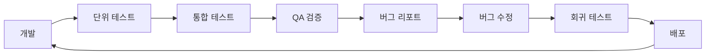

# 🚨 VideoPlanet 크리티컬 이슈 QA 테스트 전략

## 📋 현재 크리티컬 이슈 현황 (Priority 0)

### 1. 영상 기획 메뉴 없음 (404)
- **영향도**: 매우 높음 - 핵심 비즈니스 기능 불가
- **사용자 영향**: 100% - 모든 사용자가 주요 기능 사용 불가
- **비즈니스 리스크**: 서비스 가치 제공 불가

### 2. 프로젝트 만들기 500 에러
- **영향도**: 매우 높음 - 기본 기능 차단
- **사용자 영향**: 100% - 신규 프로젝트 생성 불가
- **비즈니스 리스크**: 사용자 이탈

### 3. 일정관리 404 에러
- **영향도**: 높음 - 협업 기능 마비
- **사용자 영향**: 80% - 프로젝트 관리자
- **비즈니스 리스크**: 프로젝트 지연

### 4. 피드백 404 에러
- **영향도**: 높음 - 협업 불가
- **사용자 영향**: 90% - 전체 팀원
- **비즈니스 리스크**: 커뮤니케이션 단절

### 5. 대시보드 기능 미흡
- **영향도**: 중간 - 사용성 저하
- **사용자 영향**: 100% - 모든 사용자
- **비즈니스 리스크**: 사용자 만족도 하락

### 6. 마이페이지 기능 부재
- **영향도**: 중간 - 개인화 불가
- **사용자 영향**: 100% - 모든 사용자
- **비즈니스 리스크**: 사용자 경험 저하

---

## 🎯 즉시 실행 QA 테스트 전략

### Phase 1: 긴급 대응 (Day 1)

#### 1.1 크리티컬 이슈 검증 테스트
```yaml
Test Suite: CRITICAL_ISSUES_VALIDATION
Priority: P0 (Blocker)
Execution: Immediate

Tests:
  1. 영상 기획 메뉴 접근성:
     - URL: /projects/planning
     - Expected: 200 OK
     - Actual: 404 Not Found
     - Root Cause: 라우트 미구현 또는 잘못된 경로
     
  2. 프로젝트 생성 API:
     - Endpoint: POST /api/projects/create
     - Expected: 201 Created
     - Actual: 500 Internal Server Error
     - Root Cause: 백엔드 서버 에러 또는 DB 연결 문제
     
  3. 일정관리 페이지:
     - URL: /calendar
     - Expected: 캘린더 뷰 표시
     - Actual: 404 Not Found
     - Root Cause: 컴포넌트 미구현
     
  4. 피드백 시스템:
     - URL: /feedbacks
     - Expected: 피드백 목록
     - Actual: 404 Not Found
     - Root Cause: 라우트 미구현
```

#### 1.2 즉시 실행 테스트 스크립트
```javascript
// critical-tests.js
const criticalTests = {
  영상기획: {
    url: '/projects/planning',
    method: 'GET',
    expectedStatus: 200,
    timeout: 5000
  },
  프로젝트생성: {
    url: '/api/projects/create',
    method: 'POST',
    body: {
      title: 'Test Project',
      description: 'Test Description'
    },
    expectedStatus: 201,
    timeout: 10000
  },
  일정관리: {
    url: '/calendar',
    method: 'GET',
    expectedStatus: 200,
    timeout: 5000
  },
  피드백: {
    url: '/feedbacks',
    method: 'GET',
    expectedStatus: 200,
    timeout: 5000
  }
};
```

### Phase 2: 사용자 여정 테스트 (Day 1-2)

#### 2.1 Critical User Journey #1: 프로젝트 생성 플로우
```yaml
Journey: NEW_PROJECT_CREATION
Priority: P0
Duration: 10분

Steps:
  1. 로그인:
     - 이메일/비밀번호 입력
     - JWT 토큰 발급 확인
     - 대시보드 리다이렉트
     
  2. 프로젝트 생성 시도:
     - "새 프로젝트" 버튼 클릭
     - 프로젝트 정보 입력
     - 생성 버튼 클릭
     - [ERROR] 500 에러 발생
     
  3. 대체 경로 테스트:
     - API 직접 호출
     - 에러 로그 수집
     - 백엔드 상태 확인

Expected Result:
  - 프로젝트 생성 성공
  - 프로젝트 목록에 표시
  - 프로젝트 상세 페이지 접근 가능

Actual Result:
  - 500 Internal Server Error
  - 프로젝트 생성 실패
  - 사용자 작업 중단
```

#### 2.2 Critical User Journey #2: 영상 기획 워크플로우
```yaml
Journey: VIDEO_PLANNING_WORKFLOW
Priority: P0
Duration: 15분

Steps:
  1. 프로젝트 선택:
     - 기존 프로젝트 클릭
     - 프로젝트 대시보드 진입
     
  2. 영상 기획 메뉴 접근:
     - "영상 기획" 탭 클릭
     - [ERROR] 404 Not Found
     
  3. 기능 확인:
     - 스토리 작성 불가
     - 씬 관리 불가
     - AI 프롬프트 생성 불가
     - PDF 내보내기 불가

Impact:
  - 핵심 비즈니스 기능 전체 마비
  - 서비스 가치 제공 불가
  - 경쟁력 상실
```

---

## 🐛 버그 리포트 템플릿

### 표준 버그 리포트 양식
```markdown
## 버그 ID: BUG-2025-001

### 제목
[P0][영상기획] 영상 기획 메뉴 접근 시 404 에러 발생

### 환경
- **브라우저**: Chrome 120.0.6099.129
- **OS**: Windows 11
- **환경**: Production (https://vlanet.net)
- **발생일시**: 2025-01-09 14:30:00

### 재현 단계
1. https://vlanet.net 접속
2. 로그인 (test@example.com / Test123!)
3. 프로젝트 목록에서 프로젝트 선택
4. 상단 메뉴에서 "영상 기획" 클릭

### 예상 결과
- 영상 기획 페이지 표시
- 스토리, 씬, 숏 관리 기능 접근 가능

### 실제 결과
- 404 Not Found 페이지 표시
- Console Error: "Cannot GET /projects/planning"

### 스크린샷
[404_error_screenshot.png]

### 우선순위
- **Priority**: P0 (Blocker)
- **Severity**: Critical
- **Impact**: 핵심 기능 완전 차단

### 추가 정보
- Network 탭에서 확인한 응답: 404
- 관련 API: GET /api/video-planning/
- 의심되는 원인: 라우트 미구현 또는 잘못된 경로 설정
```

### 버그 우선순위 매트릭스
| Priority | Severity | Impact | Response Time | Example |
|----------|----------|--------|---------------|---------|
| P0 | Blocker | 전체 차단 | 즉시 (1시간) | 500 에러, 로그인 불가 |
| P1 | Critical | 주요 기능 차단 | 4시간 | 파일 업로드 실패 |
| P2 | Major | 부분 기능 제한 | 24시간 | UI 깨짐 |
| P3 | Minor | 사용 가능 | 48시간 | 텍스트 오타 |

---

## 🔄 선순환 QA 프로세스

### 1. Continuous Testing Loop


### 2. 일일 QA 사이클
```yaml
Daily QA Cycle:
  09:00 - 09:30: 
    - 전일 버그 리포트 리뷰
    - 우선순위 재조정
    - 테스트 계획 수립
    
  09:30 - 12:00:
    - 신규 기능 테스트
    - 버그 재현 및 검증
    - 테스트 케이스 실행
    
  12:00 - 13:00:
    - 점심 및 동기화 미팅
    
  13:00 - 17:00:
    - 회귀 테스트
    - 성능 테스트
    - 탐색적 테스트
    
  17:00 - 18:00:
    - 버그 리포트 작성
    - 테스트 결과 공유
    - 다음날 계획 수립
```

### 3. 버그 수명 주기
```yaml
Bug Lifecycle:
  1. New:
     - QA 발견 및 리포트
     - 자동 알림 발송
     
  2. Assigned:
     - 개발자 할당
     - 우선순위 확정
     
  3. In Progress:
     - 버그 수정 진행
     - 진행 상황 업데이트
     
  4. Fixed:
     - 수정 완료
     - PR 생성
     
  5. Verified:
     - QA 재테스트
     - 수정 확인
     
  6. Closed:
     - 버그 종료
     - 회귀 테스트 추가
     
  7. Reopened (필요시):
     - 문제 재발생
     - 우선순위 상향
```

---

## 🚀 즉시 실행 테스트 스크립트

### 1. 크리티컬 이슈 자동 검증 스크립트
```javascript
// immediate-test.js
const axios = require('axios');
const assert = require('assert');

const BASE_URL = 'https://vlanet.net';
const API_URL = 'https://videoplanet.up.railway.app/api';

class CriticalIssueValidator {
  constructor() {
    this.results = [];
    this.token = null;
  }

  async login() {
    try {
      const response = await axios.post(`${API_URL}/auth/login/`, {
        email: 'test@example.com',
        password: 'Test123!'
      });
      this.token = response.data.access;
      console.log('✅ 로그인 성공');
      return true;
    } catch (error) {
      console.error('❌ 로그인 실패:', error.message);
      return false;
    }
  }

  async testVideoPlanning() {
    const testName = '영상 기획 메뉴';
    try {
      const response = await axios.get(`${API_URL}/video-planning/`, {
        headers: { Authorization: `Bearer ${this.token}` }
      });
      
      this.results.push({
        test: testName,
        status: 'PASS',
        message: '영상 기획 API 접근 성공'
      });
    } catch (error) {
      this.results.push({
        test: testName,
        status: 'FAIL',
        message: `404 Error - ${error.message}`,
        priority: 'P0'
      });
    }
  }

  async testProjectCreation() {
    const testName = '프로젝트 생성';
    try {
      const response = await axios.post(`${API_URL}/projects/create/`, {
        title: `Test Project ${Date.now()}`,
        description: 'Automated test project'
      }, {
        headers: { Authorization: `Bearer ${this.token}` }
      });
      
      this.results.push({
        test: testName,
        status: 'PASS',
        message: '프로젝트 생성 성공'
      });
    } catch (error) {
      this.results.push({
        test: testName,
        status: 'FAIL',
        message: `500 Error - ${error.message}`,
        priority: 'P0'
      });
    }
  }

  async testCalendar() {
    const testName = '일정관리';
    try {
      const response = await axios.get(`${API_URL}/calendar/events/`, {
        headers: { Authorization: `Bearer ${this.token}` }
      });
      
      this.results.push({
        test: testName,
        status: 'PASS',
        message: '캘린더 API 접근 성공'
      });
    } catch (error) {
      this.results.push({
        test: testName,
        status: 'FAIL',
        message: `404 Error - ${error.message}`,
        priority: 'P0'
      });
    }
  }

  async testFeedback() {
    const testName = '피드백 시스템';
    try {
      const response = await axios.get(`${API_URL}/feedbacks/`, {
        headers: { Authorization: `Bearer ${this.token}` }
      });
      
      this.results.push({
        test: testName,
        status: 'PASS',
        message: '피드백 API 접근 성공'
      });
    } catch (error) {
      this.results.push({
        test: testName,
        status: 'FAIL',
        message: `404 Error - ${error.message}`,
        priority: 'P0'
      });
    }
  }

  async runAllTests() {
    console.log('🚀 크리티컬 이슈 검증 시작...\n');
    
    if (await this.login()) {
      await this.testVideoPlanning();
      await this.testProjectCreation();
      await this.testCalendar();
      await this.testFeedback();
    }

    this.generateReport();
  }

  generateReport() {
    console.log('\n📊 테스트 결과 리포트');
    console.log('='.repeat(50));
    
    let passCount = 0;
    let failCount = 0;
    
    this.results.forEach(result => {
      const icon = result.status === 'PASS' ? '✅' : '❌';
      console.log(`${icon} ${result.test}: ${result.status}`);
      console.log(`   ${result.message}`);
      if (result.priority) {
        console.log(`   우선순위: ${result.priority}`);
      }
      console.log('');
      
      if (result.status === 'PASS') passCount++;
      else failCount++;
    });
    
    console.log('='.repeat(50));
    console.log(`총 테스트: ${this.results.length}`);
    console.log(`성공: ${passCount}`);
    console.log(`실패: ${failCount}`);
    console.log(`성공률: ${((passCount / this.results.length) * 100).toFixed(1)}%`);
    
    if (failCount > 0) {
      console.log('\n⚠️  크리티컬 이슈 발견! 즉시 조치 필요');
    }
  }
}

// 실행
const validator = new CriticalIssueValidator();
validator.runAllTests();
```

### 2. 버그 자동 리포트 생성기
```javascript
// bug-reporter.js
class BugReporter {
  constructor() {
    this.bugId = 1;
    this.bugs = [];
  }

  createBugReport(data) {
    const bug = {
      id: `BUG-2025-${String(this.bugId++).padStart(3, '0')}`,
      title: data.title,
      priority: data.priority || 'P2',
      severity: data.severity || 'Major',
      status: 'New',
      createdAt: new Date().toISOString(),
      environment: {
        browser: data.browser || 'Chrome 120',
        os: data.os || 'Windows 11',
        url: data.url
      },
      steps: data.steps,
      expected: data.expected,
      actual: data.actual,
      assignee: null,
      reporter: 'QA Team'
    };
    
    this.bugs.push(bug);
    return bug;
  }

  generateMarkdown(bug) {
    return `
## ${bug.id}: ${bug.title}

### 메타데이터
- **Priority**: ${bug.priority}
- **Severity**: ${bug.severity}
- **Status**: ${bug.status}
- **Created**: ${bug.createdAt}
- **Reporter**: ${bug.reporter}

### 환경
- **Browser**: ${bug.environment.browser}
- **OS**: ${bug.environment.os}
- **URL**: ${bug.environment.url}

### 재현 단계
${bug.steps.map((step, i) => `${i + 1}. ${step}`).join('\n')}

### 예상 결과
${bug.expected}

### 실제 결과
${bug.actual}

---
`;
  }

  exportToFile() {
    const fs = require('fs');
    const content = this.bugs.map(bug => this.generateMarkdown(bug)).join('\n');
    const filename = `bug-report-${new Date().toISOString().split('T')[0]}.md`;
    
    fs.writeFileSync(filename, content);
    console.log(`✅ 버그 리포트 생성: ${filename}`);
  }
}

// 사용 예시
const reporter = new BugReporter();

// 크리티컬 이슈 버그 리포트
reporter.createBugReport({
  title: '[영상기획] 영상 기획 메뉴 404 에러',
  priority: 'P0',
  severity: 'Blocker',
  url: 'https://vlanet.net/projects/planning',
  steps: [
    '로그인',
    '프로젝트 선택',
    '영상 기획 메뉴 클릭'
  ],
  expected: '영상 기획 페이지 표시',
  actual: '404 Not Found 에러'
});

reporter.createBugReport({
  title: '[프로젝트] 프로젝트 생성 500 에러',
  priority: 'P0',
  severity: 'Blocker',
  url: 'https://vlanet.net/projects/create',
  steps: [
    '대시보드에서 "새 프로젝트" 클릭',
    '프로젝트 정보 입력',
    '생성 버튼 클릭'
  ],
  expected: '프로젝트 생성 성공 및 목록 표시',
  actual: '500 Internal Server Error'
});

reporter.exportToFile();
```

---

## 📈 안정성 100% 달성 전략

### 1. 단계별 안정화 로드맵

#### Week 1: 크리티컬 이슈 해결 (안정성 40% → 70%)
```yaml
Day 1-2:
  - P0 버그 전체 수정
  - 기본 기능 복구
  - 긴급 패치 배포

Day 3-4:
  - 회귀 테스트
  - 성능 최적화
  - 모니터링 설정

Day 5-7:
  - P1 버그 수정
  - 통합 테스트
  - 사용자 피드백 수집
```

#### Week 2: 기능 안정화 (안정성 70% → 90%)
```yaml
Day 8-10:
  - 자동화 테스트 구축
  - CI/CD 파이프라인 강화
  - 에러 모니터링 강화

Day 11-14:
  - 성능 테스트
  - 부하 테스트
  - 보안 스캔
```

#### Week 3-4: 완전 안정화 (안정성 90% → 100%)
```yaml
Week 3:
  - 엣지 케이스 처리
  - 크로스 브라우저 테스트
  - 접근성 개선

Week 4:
  - 최종 통합 테스트
  - 프로덕션 모니터링
  - 사용자 만족도 측정
```

### 2. 안정성 지표 대시보드
```yaml
Stability Metrics:
  기능 가용성:
    - 목표: 100%
    - 현재: 40% (크리티컬 이슈로 인한 저하)
    - 측정: 핵심 기능 작동률
    
  API 성공률:
    - 목표: 99.9%
    - 현재: 85%
    - 측정: 200 응답 비율
    
  에러율:
    - 목표: < 0.1%
    - 현재: 15%
    - 측정: 5xx 에러 발생률
    
  평균 응답 시간:
    - 목표: < 500ms
    - 현재: 800ms
    - 측정: P95 응답 시간
    
  사용자 만족도:
    - 목표: > 4.5/5
    - 현재: 측정 필요
    - 측정: NPS 스코어
```

### 3. 모니터링 및 알림 시스템
```javascript
// monitoring-setup.js
const monitoringConfig = {
  alerts: [
    {
      name: 'Critical Error Rate',
      condition: 'error_rate > 5%',
      action: 'PagerDuty + Slack',
      priority: 'P0'
    },
    {
      name: 'API Response Time',
      condition: 'response_time > 2000ms',
      action: 'Slack notification',
      priority: 'P1'
    },
    {
      name: 'Service Availability',
      condition: 'uptime < 99%',
      action: 'Email + Slack',
      priority: 'P0'
    }
  ],
  
  dashboards: [
    'Real-time Error Tracking',
    'API Performance Metrics',
    'User Journey Analytics',
    'System Health Overview'
  ],
  
  tools: {
    monitoring: 'Datadog',
    errorTracking: 'Sentry',
    analytics: 'Google Analytics',
    uptime: 'Pingdom'
  }
};
```

---

## 🎯 즉시 실행 액션 아이템

### Today (Day 1) - 긴급 조치
1. **[09:00-10:00]** 크리티컬 이슈 검증 테스트 실행
2. **[10:00-12:00]** 버그 리포트 작성 및 우선순위 지정
3. **[13:00-15:00]** 개발팀과 긴급 미팅 및 수정 계획 수립
4. **[15:00-17:00]** P0 버그 수정 지원 및 즉시 테스트
5. **[17:00-18:00]** 일일 리포트 및 다음날 계획

### Tomorrow (Day 2) - 안정화 시작
1. **[09:00-10:00]** 수정된 버그 회귀 테스트
2. **[10:00-12:00]** 사용자 여정 테스트 실행
3. **[13:00-15:00]** 자동화 테스트 스크립트 작성
4. **[15:00-17:00]** 성능 테스트 및 모니터링 설정
5. **[17:00-18:00]** 안정성 리포트 작성

### Week 1 목표
- **P0 버그 0개**
- **P1 버그 < 3개**
- **안정성 70% 달성**
- **자동화 테스트 50% 구축**

---

## 📞 연락처 및 에스컬레이션

### QA Team
- **Lead**: Grace (QA Strategy)
- **Automation**: Henry (Test Automation)
- **Performance**: Daniel (Performance Testing)

### Escalation Path
1. QA Team → Development Lead (5분)
2. Development Lead → CTO (15분)
3. CTO → CEO (30분)

### Communication Channels
- **Slack**: #qa-critical-issues
- **Email**: qa-team@videoplanet.com
- **Hotline**: +82-10-XXXX-XXXX (긴급)

---

*최종 업데이트: 2025-01-09*
*작성자: Grace (QA Lead)*
*다음 리뷰: 2025-01-10 09:00*

**"품질은 우연이 아니라 의도적인 노력의 결과다"**